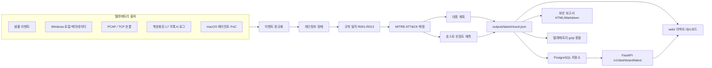

# LayerTrace EDR/SIEM 개념 검증(PoC)

**L7 트래픽 기반 EDR 위협 탐지 및 대응 플랫폼**

엔드포인트에서 발생하는 프로세스, 네트워크, 파일, DNS, PCAP, L7 메타데이터를 모아
보안 위협을 탐지하고, MITRE ATT&CK 기준으로 분류한 뒤 대시보드와 보고서로 보여주는
로컬 실행형 보안 개념 검증입니다.

> Python 3.11+ · Node.js/npm 리액트 대시보드 · PostgreSQL 저장소 · Windows 로컬 메타데이터 수집 지원 · Docker Compose · 대시보드/보고서/OpenAPI 자동 생성

---

## 한 줄로 설명하면

PC 안에서 생기는 여러 보안 신호를 모아서
`위험한 행동인지`, `어떤 공격 단계인지`, `어떤 대응이 필요한지`를 자동으로 정리해주는
미니 EDR + SIEM 플랫폼입니다.

```text
샘플 / 로컬 엔드포인트 / PCAP / L7 메타데이터
-> 스키마 검증 / 실패 대기열(DLQ)
-> 개인정보 마스킹
-> 탐지 규칙
-> MITRE ATT&CK 매핑
-> 규칙 기반 위험 예측
-> 대응 계획
-> SIEM 질의 결과 / 엔드포인트 송신 토폴로지
-> PostgreSQL 저장소 / 워커 경계
-> React 대시보드 + 보고서 + gzip 파이프라인 묶음
```

---

## 아키텍처



ERD, SA, 작업 계획 같은 문서 산출물은 로컬 `docs/`에만 보관하고 GitHub에는 README만 남깁니다.

---

## 빠른 시작

```powershell
cd team-C-edr
uv run python -m src.run
```

실행하면 최신 결과가 자동으로 생성됩니다.

```text
outputs/latest/result.json
web/public/latest-result.json
outputs/reports/latest/security_report.html
outputs/reports/latest/security_report.md
outputs/pipeline/latest/telemetry_bundle.json.gz
```

대시보드에서 `보고서 열기`를 누르면 팝업 보고서가 열리고, `PDF로 저장`은 브라우저의 print-to-PDF 흐름을 사용합니다. 사용자 화면에는 raw `result.json` 링크를 노출하지 않습니다.

화면은 현재 읽는 마지막 명령줄 실행 결과를 데이터 출처로 표시합니다. 소스를 바꾸려면 `uv run python -m src.run`, `uv run python -m src.run --collect-local`, `uv run python -m src.run --collect-local --include-dns-cache`, `uv run python -m src.run --l7-file samples\decrypted_l7_records.json` 중 하나로 다시 실행한 뒤 대시보드를 새로고침합니다.

---

## 리액트 대시보드

리액트 대시보드는 `/v1/dashboard/latest`를 먼저 읽습니다. 운영 빌드에서 API가 실패하면 `api_error` 상태를 표시하며, `web/public/latest-result.json` 정적 대체 파일은 `VITE_LAYERTRACE_ALLOW_DEMO_FALLBACK=true` 같은 demo/local flag를 명시한 경우에만 사용합니다.

```powershell
npm install
npm run build
npm run preview
```

백엔드와 프론트를 분리 배포할 때는 프론트 빌드 환경에 API 주소를 넣습니다.

```powershell
$env:VITE_LAYERTRACE_API_BASE_URL="http://localhost:8080"
$env:VITE_LAYERTRACE_ALLOW_DEMO_FALLBACK="false"
npm run build
```

`npm run preview`는 Vite 미리보기 서버로 `dist/`를 띄웁니다. 데이터 소스를 바꾸는 방식은 동일하게 `uv run python -m src.run ...`을 먼저 다시 실행한 뒤 리액트 화면을 새로고침하는 흐름입니다.

---

## Docker Compose 실행

Default compose deployment starts PostgreSQL, API, worker, and frontend only. Redpanda/Kafka is intentionally excluded until a real outbox publisher and consumer exist; any outbox rows remain stored in PostgreSQL and are not published by this stack.

```powershell
Copy-Item .env.example .env
# Set POSTGRES_PASSWORD and LAYERTRACE_API_TOKEN in .env before starting.
npm run local:up
```

기존 PostgreSQL 데이터베이스에 이번 lineage schema를 적용할 때는 배포 전에 `migrations/20260707_deployment_lineage.sql`을 실행합니다. 새 데이터베이스는 서비스 시작 시 SQLAlchemy 모델에서 동일한 테이블과 FK를 생성합니다.

접속 주소:

| 화면/서비스 | URL |
|---|---|
| 리액트 대시보드 | `http://localhost:3000` |
| FastAPI 문서 | `http://localhost:8080/docs` |
| OpenAPI JSON | `http://localhost:8080/openapi.json` |
| 상태 확인 | `http://localhost:8080/v1/health` |

종료:

```powershell
npm run local:down
```

---

## 자동 검증

전체 PoC가 제대로 동작하는지 한 번에 확인합니다.

```powershell
uv run python scripts\validate_poc.py
```

개별 단위 테스트만 돌릴 수도 있습니다.

```powershell
uv run python -m unittest discover -s tests
```

성공하면 `outputs/verification/latest_verification.json`에 검증 결과가 남습니다.

---

## 실제 Windows 텔레메트리 수집

현재 Windows PC에서 허용된 메타데이터만 수집해 같은 탐지 엔진과 대시보드에 태웁니다.

```powershell
uv run python -m src.run --collect-local
```

DNS 캐시까지 보고 싶을 때만 명시적으로 켭니다.

```powershell
uv run python -m src.run --collect-local --include-dns-cache
```

수집하는 것:

| 구분 | 내용 |
|------|------|
| 프로세스 | 프로세스 이름, 경로, 부모 프로세스 |
| 네트워크 | 연결된 TCP 세션, 원격 IP, 원격 포트, 소유 프로세스 |
| 파일 | Downloads 폴더의 최근 실행/압축 파일 메타데이터, 해시 |
| 선택 DNS | DNS 캐시 도메인, 응답, 레코드 타입 |

수집하지 않는 것:

| 구분 | 이유 |
|------|------|
| 패킷 본문 | 민감 데이터 가능성이 높음 |
| HTTPS 본문 | 승인 없는 본문 수집 방지 |
| 메시지/채팅 내용 | 개인정보 보호 |
| 키 입력/클립보드 | 개념 검증 범위 밖 |
| 문서 본문 | 원문 내용 수집 방지 |

Windows 수집 경로는 분리되어 있습니다.

- 프로세스 텔레메트리: Windows `Win32_Process`/프로세스 스냅샷 계열에서 프로세스 이름, 경로, 부모 프로세스를 가져옵니다.
- DNS 캐시 텔레메트리: 해석기/캐시 관측값을 별도 출처로 가져옵니다. DNS 값은 Win32 프로세스에서 직접 나오는 것이 아니라, 나중에 `host_id`, `process_name`, `domain`, `event_time`으로 SIEM 상관분석합니다.

---

## REST API / Swagger 계약

현재 로컬 PoC는 CLI 실행을 기본으로 두고, 고객사별 업로드/조회 계약은 FastAPI REST로 구현했습니다.

```text
/docs
/openapi.json
```

로컬 REST 서버 실행:

```powershell
uv run python scripts\run_service.py --no-seed-latest
```

구현된 엔드포인트:

| 엔드포인트 | 용도 |
|---|---|
| `GET /v1/health` | REST, PostgreSQL, 작업 실행기 상태 확인 |
| `POST /v1/telemetry/events` | 텔레메트리 이벤트 묶음 수신 후 분석 작업 등록 |
| `GET /v1/tasks/{task_id}` | 등록된 분석 작업의 상태, 결과, 오류 조회 |
| `GET /v1/dashboard/latest` | PostgreSQL에 저장된 최신 대시보드 페이로드 조회 |
| `GET /v1/incidents?severity=critical` | 인시던트 조회 및 심각도 필터 |
| `GET /v1/reports/latest` | 최신 보고서 메타데이터와 브라우저 PDF 저장 방식 안내 |

필수 헤더:

| 헤더 | 의미 |
|---|---|
| `X-Customer-Id` | 고객사 구분 |
| `X-Tenant-Id` | 테넌트 구분 |
| `X-Agent-Version` | 엔드포인트 수집기 버전 |
| `X-Payload-Version` | 텔레메트리 스키마 버전 |

이 PoC의 현재 API 범위는 REST와 FastAPI 자동 OpenAPI 문서입니다.

---

## PCAP / TCP 흐름 분석

`.pcap` 파일을 읽어 TCP 흐름을 만들고, 평문 HTTP 요청이 있으면 `http_request` 이벤트로 변환합니다.

```powershell
uv run python -m src.run --pcap-file samples\some_capture.pcap
```

담당 코드:

```text
src/pcap_flow.py
```

---

## HTTPS / L7 상세 분석

이 PoC는 임의의 HTTPS를 몰래 복호화하지 않습니다.
승인된 로컬 프록시/CA 또는 테스트 프록시가 남긴 복호화 L7 메타데이터를 입력으로 받습니다.

```powershell
uv run python -m src.run --l7-file samples\decrypted_l7_records.json
```

테스트용 명시적 프록시도 포함되어 있습니다.

```powershell
uv run python scripts\https_inspection_proxy.py --certfile cert.pem --keyfile key.pem --output outputs\l7_proxy\records.jsonl
uv run python -m src.run --l7-file outputs\l7_proxy\records.jsonl
```

담당 코드:

```text
src/l7_inspector.py
scripts/https_inspection_proxy.py
```

---

## macOS 에이전트 개념 검증

macOS에서는 `tcpdump` 기반 네트워크 메타데이터를 이벤트 스키마로 바꿉니다.

```bash
python3 -m src.mac_agent --simulate
sudo python3 -m src.mac_agent --iface en0 --duration 30
```

백그라운드 실행용 LaunchAgent 스크립트도 있습니다.

```bash
bash scripts/install_mac_agent.sh
bash scripts/uninstall_mac_agent.sh
```

담당 코드:

```text
src/mac_agent.py
scripts/install_mac_agent.sh
scripts/uninstall_mac_agent.sh
```

---

## 대시보드

대시보드는 `web/`의 React/Vite 앱입니다. `/v1/dashboard/latest`를 우선 읽고, 운영 모드에서 API 실패 시 `api_error` 상태를 표시합니다. 단독 demo 미리보기에서만 `VITE_LAYERTRACE_ALLOW_DEMO_FALLBACK=true`를 지정해 `web/public/latest-result.json` fallback 데이터를 사용할 수 있습니다.

주요 화면:

| 영역 | 내용 |
|------|------|
| 엔드포인트 송신 토폴로지 | 엔드포인트 집합, 보호 테넌트 경계, 외부 목적지를 SVG 그래프로 시각화 |
| 탐지 차트 | 심각도 구성, 이벤트 대비 알림 수, MITRE 전술 범위 차트 |
| 개요 | 알림 수, 인시던트 수, 엔드포인트 위험도, 최고 위험 점수 |
| 인시던트 작업대 | 보안 콘솔 형태의 인시던트 분석 |
| MITRE ATT&CK | tactic별 탐지 분포 |
| 타임라인 | 시간순 위험 이벤트 |
| 엔드포인트 위험도 | 호스트별 위험 점수 |
| 대응 플레이북 | 시뮬레이션 대응 액션 |
| 보고서 센터 | 최신 HTML/Markdown 보고서 링크 |
| 데이터 품질 | 스키마 검증, 실패 대기열(DLQ), 개인정보 마스킹 결과 |

---

## 보고서

CLI 실행 시 공유 가능한 보안 분석 보고서가 자동 생성됩니다.

```text
outputs/reports/latest/security_report.html
outputs/reports/latest/security_report.md
```

보고서에 들어가는 내용:

| 섹션 | 설명 |
|------|------|
| 요약 | 전체 위험도와 핵심 판단 |
| 엔드포인트 위험도 | 호스트별 위험도 |
| 인시던트 요약 | 연결된 공격 흐름 |
| 알림 근거 | 탐지 근거 |
| MITRE ATT&CK 매핑 | 공격 전술/기법 매핑 |
| L7 상세 분석 | L7 메타데이터 기반 분석 |
| 위험 예측/대응 계획 | 예측 위험도와 대응 계획 |
| 파이프라인 전달 | gzip 텔레메트리 묶음 생성 결과 |
| 데이터 품질/DLQ | 유효하지 않은 이벤트 처리 |
| 권장 다음 조치 | 다음 조치 |
| 한계 | 현재 한계 |

---

## 탐지 규칙

| 규칙 | 탐지 내용 |
|------|-----------|
| R001 | 알려진 악성 도메인 접근 |
| R002 | 브라우저를 통한 의심 실행 파일 다운로드 |
| R003 | Downloads 경로에서 서명되지 않은 실행 파일 시작 |
| R004 | 주기적인 외부 연결 |
| R005 | 대량 외부 전송 |
| R006 | 업무 시간 외 드문 ASN 연결 |
| R007 | 셸 프로세스의 네트워크 연결 생성 |
| R008 | VPN 터널과 비정상 전송 결합 |
| R009 | 복호화된 L7 악성 URL 접근 |
| R010 | 악성 URL과 연결된 위험 애플리케이션 동작 |
| R011 | 알려진 악성코드 해시 시그니처 일치 |
| R012 | 고위험 탐지에 대한 대응 액션 생성 |
| R013 | 고위험 호스트 흐름 예측 |

시그니처 샘플은 아래 파일에 있습니다.

```text
rules/threat_signatures.json
```

---

## 프로젝트 구조

```text
team-C-edr/
├── src/
│   ├── run.py              # 명령줄 진입점
│   ├── local_collector.py  # Windows 로컬 메타데이터 수집기
│   ├── pcap_flow.py        # PCAP / TCP 흐름 분석기
│   ├── l7_inspector.py     # 복호화 L7 메타데이터 파서
│   ├── mac_agent.py        # macOS 대상 에이전트 개념 검증
│   ├── detection_engine.py # 탐지 규칙 + MITRE 매핑
│   ├── siem_analyzer.py    # SIEM 결과 + 엔드포인트 송신 토폴로지
│   ├── ai_predictor.py     # 규칙 기반 호스트 위험 점수
│   ├── response_engine.py  # 시뮬레이션 대응 계획
│   ├── pipeline.py         # gzip 묶음 / 선택 전송
│   ├── report_builder.py   # Markdown/HTML 보고서
│   ├── service_store.py    # PostgreSQL 실행/인시던트/작업 저장소
│   ├── service_worker.py   # 분석 워커 로직
│   ├── service_api.py      # FastAPI REST API 서버 래퍼
│   └── privacy.py          # 민감 필드 마스킹
├── web/
│   ├── index.html
│   ├── src/                # 리액트/타입스크립트 대시보드
│   └── public/
│       └── latest-result.json
├── samples/
│   ├── default_events.json
│   └── decrypted_l7_records.json
├── rules/
│   └── threat_signatures.json
├── scripts/
│   ├── build_react.mjs
│   ├── run_service.py
│   ├── run_worker.py
│   ├── validate_poc.py
│   ├── https_inspection_proxy.py
│   ├── install_mac_agent.sh
│   └── uninstall_mac_agent.sh
├── tests/
└── outputs/
```

---

## 자주 쓰는 명령어

| 목적 | 명령어 |
|------|--------|
| 샘플 데이터로 실행 | `uv run python -m src.run` |
| Windows 메타데이터 수집 | `uv run python -m src.run --collect-local` |
| DNS 캐시 포함 | `uv run python -m src.run --collect-local --include-dns-cache` |
| L7 샘플 포함 | `uv run python -m src.run --l7-file samples\decrypted_l7_records.json` |
| PCAP 포함 | `uv run python -m src.run --pcap-file samples\some_capture.pcap` |
| 파이프라인 전송 테스트 | `uv run python -m src.run --ship-url http://127.0.0.1:9000/ingest` |
| REST 서비스 실행 | `uv run python scripts\run_service.py --no-seed-latest` |
| 외부 워커 1회 실행 | `uv run python scripts\run_worker.py --once` |
| 리액트 빌드 | `npm run build` |
| 리액트 미리보기 | `npm run preview` |
| Docker Compose 상태 확인 | `npm run local:status` |
| 전체 검증 | `uv run python scripts\validate_poc.py` |
| 단위 테스트 | `uv run python -m unittest discover -s tests` |

---

## 실패 코드

| Code | 의미 |
|------|------|
| MISSING_INPUT | 입력 파일이 없음 |
| INVALID_EVENT_FILE | event JSON 형식이 잘못됨 |
| NO_VALID_EVENTS | 유효한 event가 없음 |
| DETECTION_ENGINE_FAILED | 탐지 엔진 처리 실패 |
| ADVANCED_COLLECTION_FAILED | PCAP 또는 L7 입력 처리 실패 |
| UNEXPECTED_ERROR | 예상하지 못한 오류 |

---

## 현재 한계

- 운영용 EDR 에이전트, 커널 드라이버, 투명 VPN, 패킷 드라이버는 아닙니다.
- HTTPS 상세 분석은 승인된 프록시/CA 또는 복호화 메타데이터 로그가 있어야 합니다.
- 위험 예측은 학습된 ML 모델이 아니라 특징 기반 위험 점수 계산입니다.
- 위협 인텔리전스는 `rules/threat_signatures.json`에 있는 샘플 시그니처 집합입니다.
- MITRE ATT&CK 매핑은 규칙 기반 후보 매핑입니다.
- 대시보드는 React/Vite 빌드입니다. 로그인과 실시간 스트리밍 서버는 없습니다.
- 데이터베이스는 SQLAlchemy 기반 PostgreSQL 저장소입니다.
- 큐는 PostgreSQL 작업 상태와 로컬/외부 워커 경계입니다. Redpanda/Kafka는 실제 outbox publisher와 consumer가 생기기 전까지 기본 Docker Compose 배포에서 제외됩니다.
- macOS 패킷 캡처는 실제 Mac에서 sudo/tcpdump 권한 검증이 필요합니다.

---

## 안전 안내

이 프로젝트는 교육/시연/연구용 로컬 PoC입니다.
실제 조직이나 타인의 장비에서 패킷 캡처, HTTPS 분석, 엔드포인트 텔레메트리 수집을 하려면
반드시 명시적인 승인과 내부 보안 정책 검토가 필요합니다.
