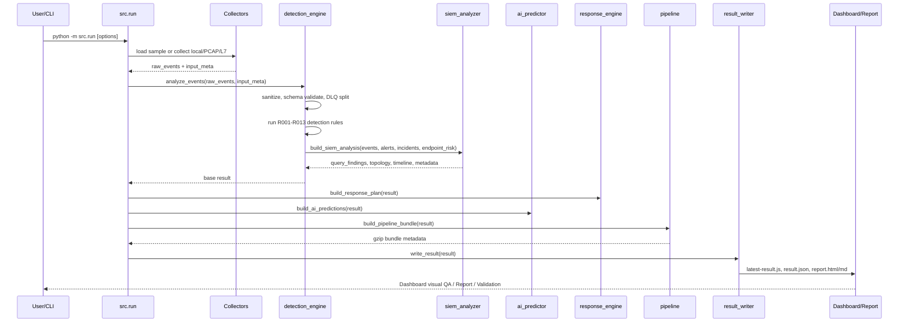

# LayerTrace EDR/SIEM PoC ERD & SA

이 문서는 현재 구현된 `security_edr_siem_poc` 기준의 ERD와 SA입니다.

현재 PoC는 `outputs/latest/result.json`, `dashboard/data/latest-result.js`, `web/public/latest-result.json` artifact를 산출하고, REST service surface용 SQLite 저장소(`outputs/service/layertrace.sqlite3`)에 최신 run, incident, local task 상태를 저장합니다. 아래 ERD는 JSON artifact의 논리 모델과 현재 SQLite 물리 테이블을 함께 설명합니다.

---

## 1. 용어 기준


| 표현 | 문서/화면 용어 | 의미 |
|---|---|---|
| Endpoint fleet | 고객사 기기, 에이전트가 설치되거나 telemetry가 수집되는 host |
| Protected tenant boundary | 고객사 네트워크/테넌트 경계와 SIEM 수집 경계 |
| External destinations | endpoint가 연결한 외부 domain/IP/URL/ASN |

현재 dashboard 첫 화면도 `Endpoint fleet -> Protected tenant boundary -> External destinations` 토폴로지로 표시합니다.

---

## 2. ERD

```mermaid
erDiagram
    TENANT ||--o{ ENDPOINT : owns
    TENANT ||--o{ RUN_RESULT : generates
    ENDPOINT ||--o{ TELEMETRY_EVENT : emits
    TELEMETRY_EVENT ||--o{ PRIVACY_ACTION : masks
    TELEMETRY_EVENT ||--o{ DLQ_EVENT : rejected_as

    DETECTION_RULE ||--o{ ALERT : triggers
    ENDPOINT ||--o{ ALERT : has
    ALERT ||--o{ ALERT_EVENT : references
    TELEMETRY_EVENT ||--o{ ALERT_EVENT : evidence_for

    ENDPOINT ||--o{ INCIDENT : has
    INCIDENT ||--o{ INCIDENT_STAGE : contains
    INCIDENT_STAGE ||--o{ INCIDENT_STAGE_EVENT : references
    TELEMETRY_EVENT ||--o{ INCIDENT_STAGE_EVENT : used_by

    ENDPOINT ||--o{ ENDPOINT_RISK : scored_as
    ENDPOINT ||--o{ AI_PREDICTION : predicted_as
    ALERT ||--o{ RESPONSE_ACTION : planned_from

    ENDPOINT ||--o{ SIEM_QUERY_FINDING : grouped_by
    DETECTION_RULE ||--o{ SIEM_QUERY_FINDING : grouped_by
    TELEMETRY_EVENT ||--o{ EGRESS_EDGE : creates
    ENDPOINT ||--o{ EGRESS_EDGE : source
    EXTERNAL_DESTINATION ||--o{ EGRESS_EDGE : target

    RUN_RESULT ||--o{ TELEMETRY_EVENT : includes
    RUN_RESULT ||--o{ ALERT : includes
    RUN_RESULT ||--o{ INCIDENT : includes
    RUN_RESULT ||--o{ ENDPOINT_RISK : includes
    RUN_RESULT ||--o{ REPORT_ARTIFACT : writes
    RUN_RESULT ||--o{ DASHBOARD_ARTIFACT : writes
    RUN_RESULT ||--o{ PIPELINE_BUNDLE : writes

    TENANT {
        string customer_id PK
        string tenant_id
        string agent_version
        string payload_version
        string schema_version
    }

    ENDPOINT {
        string host_id PK
        string host_display_name
        string endpoint_type
    }

    TELEMETRY_EVENT {
        string event_id PK
        string host_id FK
        datetime event_time
        datetime received_time
        string event_type
        string source
        string payload_version
        string process_name
        string domain
        string dst_ip
        int dst_port
        int bytes_out
    }

    DLQ_EVENT {
        int index PK
        string event_id
        string code
        json errors
        json sanitized_event
    }

    PRIVACY_ACTION {
        string event_id FK
        json masked_fields
        json actions
    }

    DETECTION_RULE {
        string rule_id PK
        string rule_name
        string description
        json mitre_mapping
        int base_risk_score
    }

    ALERT {
        string alert_id PK
        string rule_id FK
        string host_id FK
        datetime event_time
        string title
        int risk_score
        string severity
        string decision
        json evidence
        json mitre_mapping
    }

    ALERT_EVENT {
        string alert_id FK
        string event_id FK
    }

    INCIDENT {
        string incident_id PK
        string host_id FK
        int risk_score
        string severity
        string primary_category
        string decision
        json evidence
        json mitre_mapping
    }

    INCIDENT_STAGE {
        string incident_id FK
        string stage
        string summary
    }

    INCIDENT_STAGE_EVENT {
        string incident_id FK
        string stage
        string event_id FK
    }

    ENDPOINT_RISK {
        string host_id FK
        int risk_score
        string severity
        int alert_count
        int incident_count
        json top_rules
        datetime last_event_time
    }

    AI_PREDICTION {
        string prediction_id PK
        string host_id FK
        string model
        string prediction
        int score
        float confidence
        string horizon
        json features
        string reason
        datetime created_at
    }

    RESPONSE_ACTION {
        string action_id PK
        string alert_id FK
        string host_id FK
        string rule_id FK
        string mode
        string status
        string action_type
        string description
        datetime created_at
        json evidence
    }

    SIEM_QUERY_FINDING {
        string query_id PK
        string host_id FK
        string rule_id FK
        string title
        string severity
        string summary
        int evidence_count
        int alert_count
        datetime last_event_time
    }

    EXTERNAL_DESTINATION {
        string destination_id PK
        string destination
        string type
    }

    EGRESS_EDGE {
        string host_id FK
        string destination_id FK
        string through
        string protocol
        int event_count
        int alert_count
        int bytes_out
        string state
    }

    RUN_RESULT {
        string run_id PK
        string status
        string decision
        datetime generated_at
        json summary
        json limitations
    }

    REPORT_ARTIFACT {
        string run_id FK
        string latest_markdown_path
        string latest_html_path
        string run_markdown_path
        string run_html_path
    }

    DASHBOARD_ARTIFACT {
        string run_id FK
        string index_path
        string data_script_path
    }

    PIPELINE_BUNDLE {
        string run_id FK
        string compression
        int raw_bytes
        int compressed_bytes
        float compression_ratio
        string sha256
        string latest_bundle_path
        string run_bundle_path
        string ship_status
        string ship_url
    }
```



---

## 3. 핵심 엔티티 설명

| 엔티티 | 현재 구현 근거 | 설명 |
|---|---|---|
| `TENANT` | `telemetry_metadata` | 고객사/테넌트/에이전트 버전/페이로드 버전. 현재 값은 `config.py` 상수에서 생성됩니다. |
| `ENDPOINT` | `host_id`, `host_display_name` | 황건하-PC, 박소연-Laptop, 이혜령-Workstation, 이주호-Desktop 등 실제 표시명을 가진 host. |
| `TELEMETRY_EVENT` | `events[]` | 수집/로드된 유효 telemetry 원장. process, file, DNS, network, flow, L7, response, AI event가 섞입니다. |
| `DLQ_EVENT` | `dlq_events[]` | schema validation 실패 event. 원본 대신 sanitize된 event와 오류를 보관합니다. |
| `PRIVACY_ACTION` | `privacy_actions[]` | 민감 필드 제거/마스킹 이력. message body, raw payload 등은 결과에서 보존하지 않습니다. |
| `DETECTION_RULE` | `rules_run[]`, `R001`-`R013` | rule 기반 탐지 정의. signature DB, network behavior, L7, response, AI prediction을 포함합니다. |
| `ALERT` | `alerts[]` | rule이 event를 근거로 만든 탐지 결과. severity, risk_score, evidence, MITRE mapping 포함. |
| `INCIDENT` | `incidents[]` | 여러 event/alert를 공격 흐름으로 묶은 host-level 사건. |
| `ENDPOINT_RISK` | `endpoint_risk[]` | endpoint별 risk score, severity, alert/incident count 집계. |
| `SIEM_QUERY_FINDING` | `siem_analysis.query_findings[]` | host + rule 기준으로 alert를 묶은 SIEM-style 분석 결과. |
| `EGRESS_EDGE` | `siem_analysis.egress_topology.edges[]` | endpoint에서 tenant boundary를 거쳐 external destination으로 나간 연결. |
| `AI_PREDICTION` | `ai_predictions.predictions[]` | 학습 모델이 아닌 deterministic feature scoring 기반 risk prediction. |
| `RESPONSE_ACTION` | `response_plan.actions[]` | dry-run/queued 대응 계획. 실제 차단/격리는 아직 actuator 연동 전입니다. |
| `PIPELINE_BUNDLE` | `pipeline_delivery` | gzip bundle 생성 및 선택적 REST ship 결과. |
| `REPORT_ARTIFACT` | `report` | Markdown/HTML 보고서 산출물 경로. |
| `DASHBOARD_ARTIFACT` | `dashboard` | 정적 dashboard와 `latest-result.js` 경로. |

---

## 4. 현재 SQLite 저장소

현재 SQLite는 전체 telemetry 원장을 정규화해서 모두 저장하지 않고, 서비스 조회와 작업 상태에 필요한 최소 테이블만 저장합니다.

| 테이블 | 주요 컬럼 | 용도 |
|---|---|---|
| `runs` | `run_id`, `generated_at`, `status`, `decision`, `payload` | 최신 dashboard/report payload 조회용 run 저장소 |
| `incidents` | `run_id`, `incident_id`, `severity`, `risk_score`, `host_display_name`, `payload` | severity 필터가 가능한 incident 조회 |
| `tasks` | `task_id`, `task_type`, `status`, `created_at`, `updated_at`, `payload`, `result`, `error` | RabbitMQ/Celery 도입 전 local worker task 상태 |

`payload` 컬럼은 현재 PoC 단계에서 JSON을 그대로 보존합니다. 운영 DB로 전환할 때는 위 논리 ERD의 `ALERT_EVENT`, `INCIDENT_STAGE`, `INCIDENT_STAGE_EVENT` 같은 join table로 분리합니다.

---

## 5. SA: System Architecture

```mermaid
flowchart LR
    subgraph Sources["Telemetry Sources"]
        SAMPLE["Sample event file\nsamples/default_events.json"]
        LOCAL["Windows local collector\nWin32_Process / TCP / Downloads"]
        DNS["DNS cache collector\nseparate resolver/cache source"]
        PCAP["PCAP parser\nTCP flow + plaintext HTTP metadata"]
        L7["Decrypted L7 records\napproved proxy/log source"]
    end

    CLI["CLI Orchestrator\nsrc/run.py"]

    subgraph Core["Analysis Core"]
        LOAD["sample_loader / optional source merge"]
        PRIVACY["privacy masking + schema validation"]
        DETECT["detection_engine\nR001-R013 alerts"]
        INCIDENT["incident builder\nattack sequence"]
        SIEM["siem_analyzer\nquery findings / egress topology / timeline"]
        AI["ai_predictor\nfeature risk model"]
        RESPONSE["response_engine\ndry-run response plan"]
    end

    subgraph Output["Artifacts & Surfaces"]
        PIPELINE["pipeline.py\ngzip telemetry bundle\noptional REST ship"]
        RESULT["outputs/latest/result.json\noutputs/runs/{timestamp}/result.json"]
        STORE["service_store.py\nSQLite runs/incidents/tasks"]
        DASHDATA["dashboard/data/latest-result.js"]
        DASH["dashboard/index.html\nEDR/SIEM visual console"]
        REACTDATA["web/public/latest-result.json"]
        REACT["web/ React dashboard\nVite build/preview"]
        REPORT["outputs/reports/latest\nHTML + Markdown report"]
        REST["service_api.py\nREST health/dashboard/incidents/reports/ingest"]
        VALIDATE["scripts/validate_poc.py\ncompile/test/contract validation"]
    end

    SAMPLE --> CLI
    LOCAL --> CLI
    DNS --> CLI
    PCAP --> CLI
    L7 --> CLI
    CLI --> LOAD
    LOAD --> PRIVACY
    PRIVACY --> DETECT
    DETECT --> INCIDENT
    INCIDENT --> SIEM
    SIEM --> AI
    AI --> RESPONSE
    RESPONSE --> PIPELINE
    RESPONSE --> RESULT
    RESULT --> STORE
    RESULT --> DASHDATA
    RESULT --> REACTDATA
    DASHDATA --> DASH
    REACTDATA --> REACT
    STORE --> REST
    RESULT --> REPORT
    RESULT --> VALIDATE
    REPORT --> VALIDATE
    DASH --> VALIDATE
    REACT --> VALIDATE
    REST --> VALIDATE
    PIPELINE --> VALIDATE
```



---

## 6. SA: 현재 실행 흐름



---

## 7. 모듈별 책임

| 모듈 | 책임 | 주요 산출 |
|---|---|---|
| `src/run.py` | CLI entrypoint, source 선택, optional source merge, 전체 orchestration | process exit code, stdout path summary |
| `src/sample_loader.py` | sample JSON event 로드 | raw_events, input_meta |
| `src/local_collector.py` | Windows local metadata 수집 | process/network/download/DNS cache event |
| `src/pcap_flow.py` | PCAP에서 TCP flow와 평문 HTTP metadata 추출 | `flow_summary`, `http_request` event |
| `src/l7_inspector.py` | 승인된 decrypted L7 record 변환 | `http_request`, `application_action`, `decryption_event` |
| `src/privacy.py` | 민감 field 제거/마스킹 | sanitized event, privacy_actions |
| `src/detection_engine.py` | schema validation, rule 탐지, incident/risk/MITRE 집계 | result base payload |
| `src/siem_analyzer.py` | SIEM 분석 surface 생성 | query_findings, topology, timeline, destination_intelligence |
| `src/ai_predictor.py` | feature 기반 host risk prediction | ai_predictions |
| `src/response_engine.py` | rule별 dry-run 대응 계획 | response_plan.actions |
| `src/pipeline.py` | gzip telemetry bundle 생성, optional REST ship | pipeline_delivery |
| `src/report_builder.py` | HTML/Markdown 보고서 생성 | security_report.html, security_report.md |
| `src/result_writer.py` | latest/run result 저장, dashboard data script 생성 | result.json, latest-result.js |
| `src/service_store.py` | SQLite run/incident/task 저장 | `outputs/service/layertrace.sqlite3` |
| `src/service_worker.py` | local worker job 실행 경계 | saved run_id |
| `src/service_api.py` | REST 조회/ingest endpoint | health, dashboard, incidents, reports, telemetry ingest |
| `dashboard/*` | 사용자 화면 | topology graph, detection charts, alert explorer, report modal |
| `web/*` | React/TypeScript 사용자 화면 | Vite build/preview dashboard |
| `scripts/build_react.mjs` | React production build wrapper | `dist/` |
| `scripts/run_service.py` | 로컬 REST service 실행 | `http://127.0.0.1:8080` |
| `scripts/validate_poc.py` | 업로드 전 검증 | latest_verification.json |

---

## 8. 현재 API/전송 기준

현재 구현 기준은 REST ingestion 문서화와 optional gzip POST입니다.

| 항목 | 현재 구현 |
|---|---|
| 수집 전송 | REST 문서화, optional `--ship-url` gzip POST |
| 로컬 REST 조회 | `GET /v1/health`, `/v1/dashboard/latest`, `/v1/incidents`, `/v1/reports/latest` |
| 로컬 REST 수집 | `POST /v1/telemetry/events` |
| 인증/식별 | header metadata 기반 고객사/테넌트/에이전트 버전 식별 |
| 문서 | `docs/openapi.yaml` |
| 압축 | gzip bundle |
| 헤더 | `X-Customer-Id`, `X-Tenant-Id`, `X-Agent-Version`, `X-Payload-Version` |

`pipeline.py`의 optional ship은 아래 header를 사용합니다.

```text
Content-Type: application/json
Content-Encoding: gzip
X-EDR-PoC: layertrace_edr_siem_poc
X-Customer-Id: techeer-demo
X-Tenant-Id: techeer-demo-lab
X-Agent-Version: 0.3.0
X-Payload-Version: 1.1
```

---

## 9. Dashboard/Report Surface

현재 사용자에게 보이는 surface는 raw JSON 링크가 아니라 정적 dashboard와 popup report입니다.

| Surface | 파일 | 보여주는 내용 |
|---|---|---|
| Dashboard data | `dashboard/data/latest-result.js` | `window.SIEM_RESULT`에 최신 result 주입 |
| Dashboard shell | `dashboard/index.html` | topology, chart, incident, alert, report modal |
| Dashboard logic | `dashboard/app.js` | 시간 필터, severity 필터, alert inspector, topology SVG, chart rendering |
| Dashboard style | `dashboard/styles.css` | EDR/SIEM 콘솔형 dark UI |
| React data | `web/public/latest-result.json` | React dashboard가 fetch하는 최신 result |
| React app | `web/src/*` | Endpoint egress topology, severity switch, report modal |
| Report | `outputs/reports/latest/security_report.html` | 팝업/print-to-PDF 대상 HTML |
| Report markdown | `outputs/reports/latest/security_report.md` | 공유용 Markdown 보고서 |

---

## 10. 설계상 주의점

- 현재 SQLite DB는 `runs`, `incidents`, `tasks`만 물리 저장합니다. ERD의 `RUN_RESULT`, `ALERT_EVENT`, `INCIDENT_STAGE_EVENT`는 운영 저장소 도입 시 필요한 정규화 모델입니다.
- `Alert.event_ids`는 현재 JSON 배열이지만 DB에서는 `ALERT_EVENT` join table로 분리하는 것이 맞습니다.
- `Incident.detected_sequence`도 현재 JSON 배열이지만 DB에서는 `INCIDENT_STAGE`, `INCIDENT_STAGE_EVENT`로 분리하는 것이 맞습니다.
- `DNS cache`는 Win32 process에서 파생되는 값이 아니라 별도 resolver/cache source입니다. correlation은 `host_id`, `process_name`, `domain`, `event_time` 기준입니다.
- `AI_PREDICTION`은 생산 ML 모델이 아니라 deterministic PoC scoring입니다.
- `RESPONSE_ACTION`은 기본 dry-run이며 실제 kill/quarantine/firewall actuator와 연결되어 있지 않습니다.
